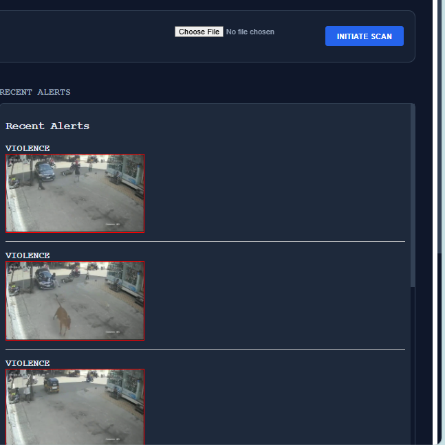
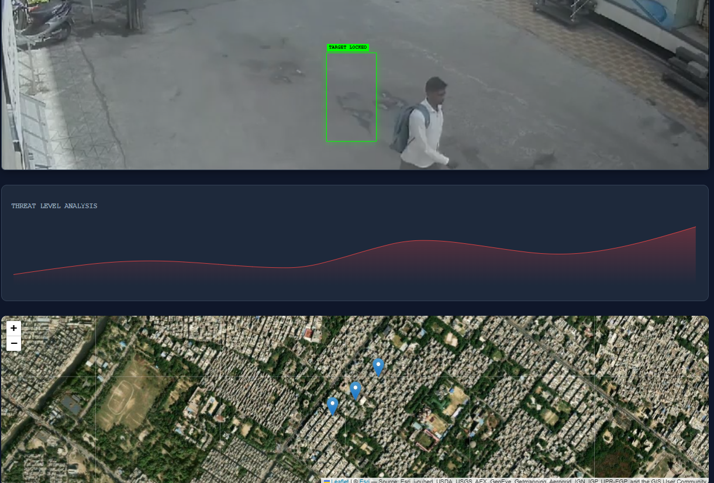

# 🛡️ SafeCity AI

### 🚀 Autonomous Surveillance & Intelligence System

---

## 🚀 Transforming CCTV into an AI-powered autonomous decision-making system

SafeCity AI is a real-time AI surveillance platform that combines **Computer Vision, Vector Search, and LLM reasoning** to detect, understand, and respond to incidents automatically.

---

## 🧠 Overview

SafeCity AI upgrades traditional CCTV systems from **passive monitoring → intelligent decision-making systems**.

It integrates:

* 🎥 Real-time video analysis (YOLOv8)
* 🧠 Semantic understanding via embeddings
* 🔍 Vector similarity search using Endee
* 🤖 Retrieval-Augmented Generation (RAG)
* ⚡ Real-time alerts via WebSockets
* 💻 Interactive command center dashboard

---

## 🚨 Problem Statement

Traditional surveillance systems:

* Require continuous human monitoring
* Miss critical incidents
* Provide no contextual understanding
* Do not use historical incident intelligence

👉 There is no system that can **detect, understand, and recommend actions in real time**

---

## 💡 Solution

SafeCity AI introduces:

* Automated incident detection
* Semantic incident understanding
* Historical similarity search
* AI-generated recommendations

---

## 🔥 What Makes This Unique?

* Combines **Computer Vision + RAG (rare combination)**
* Uses **Endee vector DB for semantic intelligence**
* Converts detection → **decision-making system**
* Full-stack real-time pipeline (CV + Backend + Frontend)

---

## 🧩 System Architecture

```
CCTV / Video Input
        ↓
YOLOv8 Detection
        ↓
Incident Builder
        ↓
Embedding Model
        ↓
Endee Vector Database
        ↓
Retriever (Top-K Similar Incidents)
        ↓
RAG (LLM Reasoning)
        ↓
FastAPI + WebSockets
        ↓
React Dashboard
```

---

## ⚙️ How It Works (End-to-End Flow)

1. YOLOv8 detects suspicious activity
2. Incident is converted into structured text
3. Text is converted into embeddings
4. Stored in Endee vector database
5. Similar incidents retrieved
6. RAG generates insights (risk, reason, action)
7. Alert sent to dashboard via WebSocket

---

## 🗄️ Endee Integration (Core Requirement)

Endee is used as the **central vector database for semantic retrieval**.

### Workflow:

* Incident → Text → Embedding
* Stored in Endee with metadata
* Queried using similarity search
* Top-K results passed into RAG

### Example Data Schema:

```json
{
  "id": "incident_001",
  "text": "person attacking another person",
  "embedding": [...],
  "metadata": {
    "location": "camera_1",
    "timestamp": "2026-03-22",
    "type": "violence"
  }
}
```

---

## 🔌 Endee API Usage

| Operation      | Endpoint                         | Purpose                    |
| -------------- | -------------------------------- | -------------------------- |
| Create Index   | POST /api/v1/index/create        | Initialize vector index    |
| Upsert Vectors | POST /api/v1/index/{name}/upsert | Store incident embeddings  |
| Query          | POST /api/v1/index/{name}/query  | Retrieve similar incidents |
| Get Stats      | GET /api/v1/index/{name}/stats   | Monitor database           |
| List Indexes   | GET /api/v1/index/list           | System health check        |

---

## 📂 Project Structure

```
SafeCity-AI/
│
├── backend/
│   ├── app/
│   │   ├── inference/
│   │   ├── services/
│   │   ├── routes/
│   │   ├── utils/
│   │   └── main.py
│   │
│   ├── events/
│   └── requirements.txt
│
├── frontend/
│   ├── src/
│   │   ├── components/
│   │   ├── pages/
│   │   └── services/api.js
│
├── endee/
├── dashboard.png
├── forensic.png
├── .env.example
└── README.md
```

---

## 📡 API Example

### Request

```json
{
  "query": "person fighting at night"
}
```

### Response

```json
{
  "risk": "High",
  "reason": "Matches previous violent patterns",
  "action": "Dispatch patrol"
}
```

---

## 📸 Demo

### Dashboard



### Forensic Analysis



---

## ⚙️ Setup Instructions

### 1️⃣ Clone Repository

```
git clone https://github.com/vikassaini77/SafeCity-AI
cd SafeCity-AI
```

---

### 2️⃣ Backend Setup

```
cd backend
pip install -r requirements.txt
uvicorn app.main:app --reload
```

---

### 3️⃣ Frontend Setup

```
cd frontend
npm install
npm run dev
```

---

### 4️⃣ Run Endee

```
git clone https://github.com/vikassaini77/endee
cd endee
docker-compose up
```

---

## 🧪 Demo Mode

System supports simulated input if camera is unavailable.

---

## ⚡ Performance

* Real-time inference supported
* Low-latency alert system
* Fast vector retrieval via Endee

---

## 🌍 Real-World Applications

* Smart City Surveillance
* Public Safety Monitoring
* Traffic & Crowd Analysis
* Campus Security Systems

---

## 🧠 Skills Demonstrated

* Computer Vision (YOLOv8)
* Vector Databases (Endee)
* Retrieval-Augmented Generation (RAG)
* FastAPI Backend
* Real-time systems (WebSockets)
* Full-stack development

---

## 🔗 Endee Requirement

* ⭐ Star: https://github.com/endee-io/endee
* 🍴 Fork: https://github.com/vikassaini77/endee

---

## 👨‍💻 Author

**Vikas Saini**

---

## 📄 License

MIT License

---

# 🚀 Final Note

SafeCity AI is not just a project —
it is a step toward **autonomous AI-driven surveillance systems for smart cities.**
